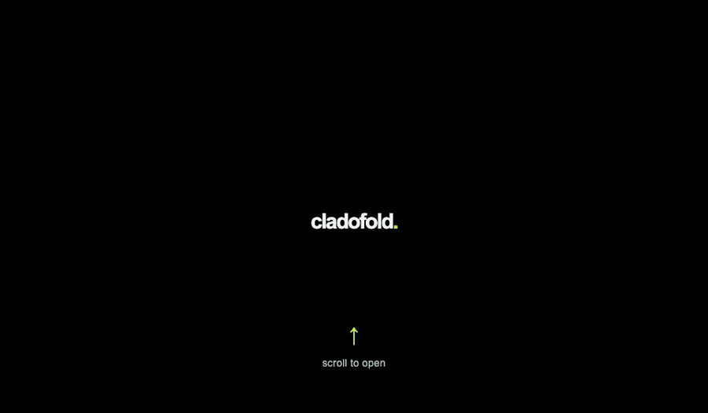

# cladofold.

<p align="center"><br><sub>six-second demo · plays automatically</sub></p>

**a softer close. a clearer open.** cladofold. adds a smooth, hinge-aware fold to your MacBook display as you close and reopen the lid.

[](https://github.com/Dantease/cladofold/releases/download/v1.3.0-preview/cladofold.-1.3.0-universal-preview.dmg)
[](#compatibility)
[](LICENSE)

### [↓ download cladofold. for Mac](https://github.com/Dantease/cladofold/releases/download/v1.3.0-preview/cladofold.-1.3.0-universal-preview.dmg)

[install](#install) · [compatibility](#compatibility) · [privacy](#privacy) · [support](#support) · [build](#build)

cladofold. softens, darkens, and draws the desktop toward the hinge. It begins from your current lid position; hold a new closing angle for one second and that becomes your new clear position. Appearance and lid behavior are adjustable in the app or its System Settings pane.

## install

1. Download the DMG, open it, and drag **cladofold.** to Applications.
2. Open the app and choose **Check Mac compatibility…**
3. Allow **Screen & System Audio Recording**, then reopen the app if macOS asks.

This is an unnotarized public preview. If macOS blocks the first launch, use **Open Anyway** in Privacy & Security. [Apple’s instructions](https://support.apple.com/102445).

## compatibility

Requires macOS 14+, Apple silicon or Intel with Metal graphics, a built-in MacBook display, and a continuous lid-angle sensor. Sensor support is expected on 14/16-inch MacBook Pro and M2-or-newer MacBook Air models. [Compatibility details](Distribution/COMPATIBILITY.md).

## privacy

No accounts, advertising, or analytics. One temporary desktop frame stays in memory during the fold, is never saved or uploaded, and is discarded when the effect clears.

## support

[Email hello@cladoconsult.com](mailto:hello@cladoconsult.com) · [Report an issue](https://github.com/Dantease/cladofold/issues)

## build

Requires Xcode or the Command Line Tools. No packages are downloaded.

```sh
./Scripts/test.sh && ./Scripts/build.sh
```

[MIT license](LICENSE) · [Contributing](CONTRIBUTING.md) · [Third-party notices](THIRD_PARTY_NOTICES.md)
